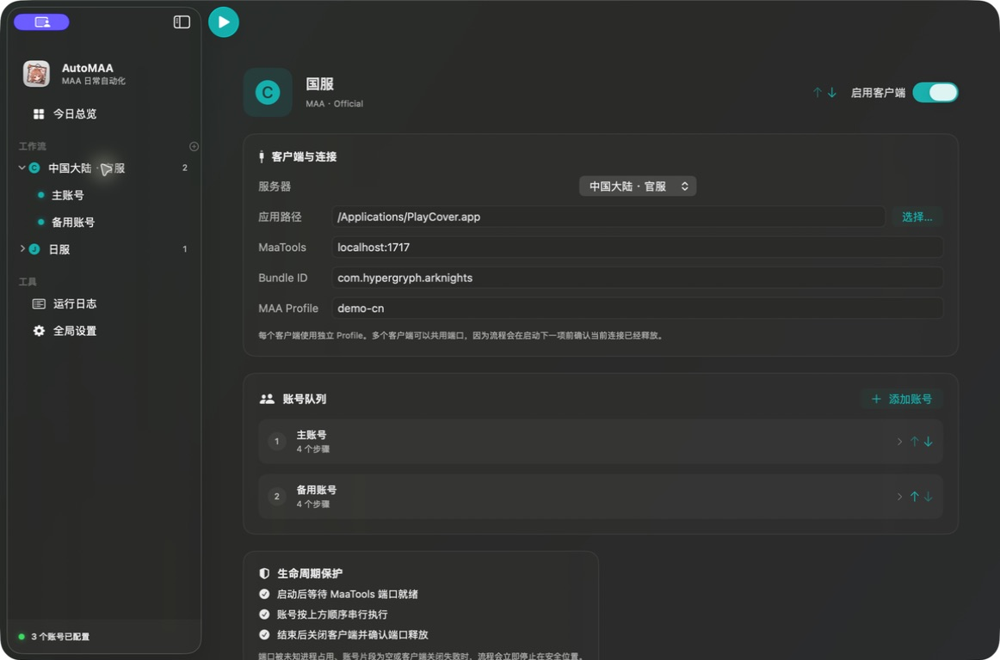
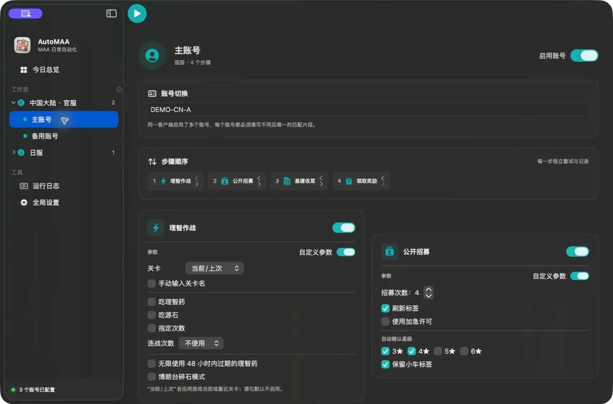
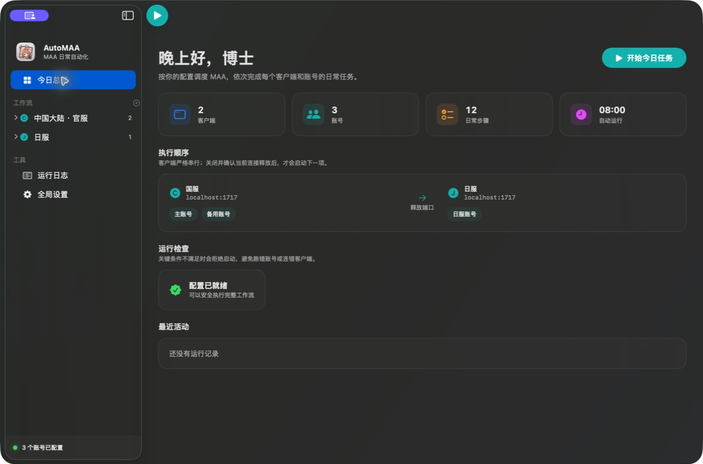

# 首次配置

完成安装后，建议在有人值守的情况下跑通一次完整流程，再启用每日自动运行。

## 1. 检查全局设置

打开“全局设置”，确认：

- `maa-cli` 路径正确；Apple Silicon Homebrew 通常是 `/opt/homebrew/bin/maa`；
- “立即更新资源”能够正常完成；
- 初次调试时先关闭每日自动运行；
- 单步骤失败重试保持 0–1 次，避免未知界面上反复操作。

“运行前热更新 MAA 资源”只更新 MaaCore 资源，不会下载或更新游戏包体。

## 2. 添加客户端

在侧边栏“工作流”旁点击添加按钮。每个客户端需要：

| 配置 | 说明 |
| --- | --- |
| 名称 | 仅用于界面与日志，例如“国服”“日服” |
| 服务器 | 决定 MAA 的资源和服务端参数 |
| 游戏 App | 选择当前连接环境中的游戏 `.app` |
| MaaTools 地址 | PlayCover + MaaTools 通常使用 `localhost:1717` |
| MAA Profile | 每个客户端必须唯一，例如 `client-cn`、`client-jp` |
| Bundle Identifier | 用于精确识别和关闭当前客户端 |

客户端会严格按照侧边栏顺序串行运行。不要给两个客户端配置相同的 Profile。

<figure class="guide-screenshot">
  
  <figcaption>客户端配置示例：两个账号共享同一个客户端，但执行顺序与 MAA Profile 都是明确、可检查的。</figcaption>
</figure>

## 3. 添加账号

一个客户端可以包含任意数量账号。

- 只有一个启用账号时，“账号匹配片段”可以留空。
- 有多个启用账号时，每个账号都必须填写非空、互不重复的匹配片段。
- 填写登录页中足以唯一识别账号的短片段，例如手机号末四位；不要填写完整手机号。
- AutoMAA 不读取、不保存游戏密码，也不会处理验证码。

第一次多账号运行时请留意登录页，确认 MAA 选中了正确账号。

## 4. 配置任务

账号内可以启用并排序：

1. [理智作战](../tasks/fight)
2. [公开招募](../tasks/recruit)
3. [基建收菜](../tasks/infrast)
4. [领取奖励](../tasks/award)

每张任务卡都有“自定义参数”开关：关闭时采用 MAA 的默认设置；开启后使用 AutoMAA 当前显示的参数。

<figure class="guide-screenshot">
  
  <figcaption>账号任务示例：顺序直接拖动调整，每张任务卡独立决定是否覆盖 MAA 默认参数。</figcaption>
</figure>

## 5. 检查并运行

回到“今日总览”：

1. 处理“运行检查”中的错误和警告。
2. 确认执行顺序与账号顺序正确。
3. 点击“开始今日任务”。
4. 观察首次账号切换、任务结果、客户端关闭和下一客户端启动。

<figure class="guide-screenshot">
  
  <figcaption>运行前总览：确认客户端、账号、任务总数和安全检查均符合预期。</figcaption>
</figure>

运行中可随时点击“安全停止”或按 `Command-.`。AutoMAA 会先终止当前 MAA 命令，再关闭游戏和释放连接。

## 6. 验证结果

在“运行日志”中确认：

- 每个账号都显示“已进入”；
- 成功任务显示“完成”；
- 客户端切换前显示“端口已释放”；
- 最后显示“全部任务执行完成”，或给出明确的人工处理提示。

流程稳定后再配置[每日自动运行](./scheduling)。
