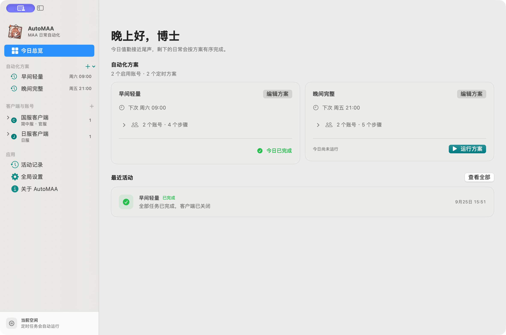
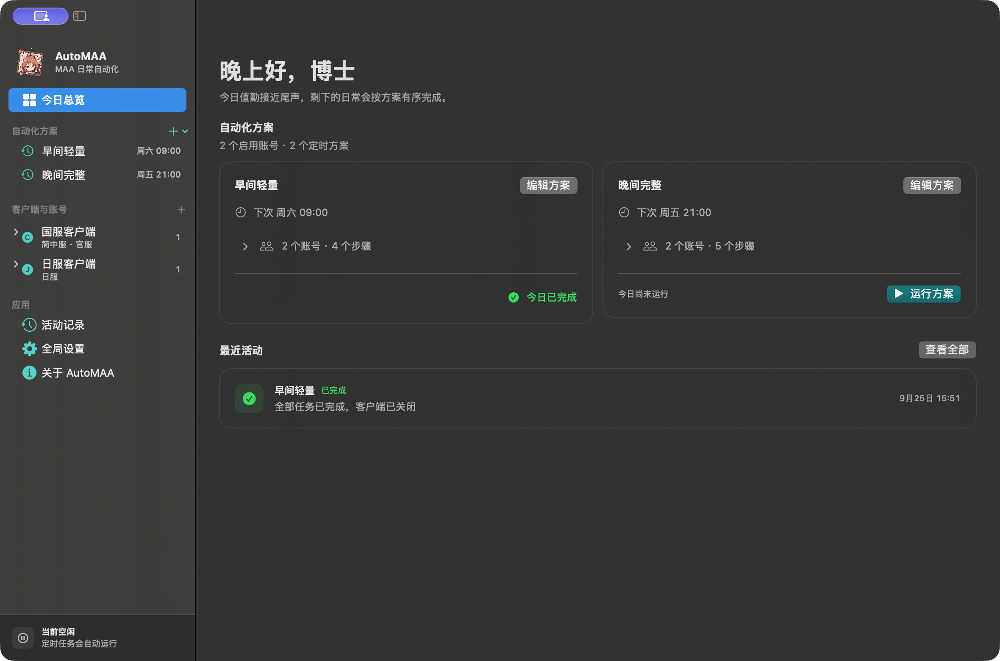
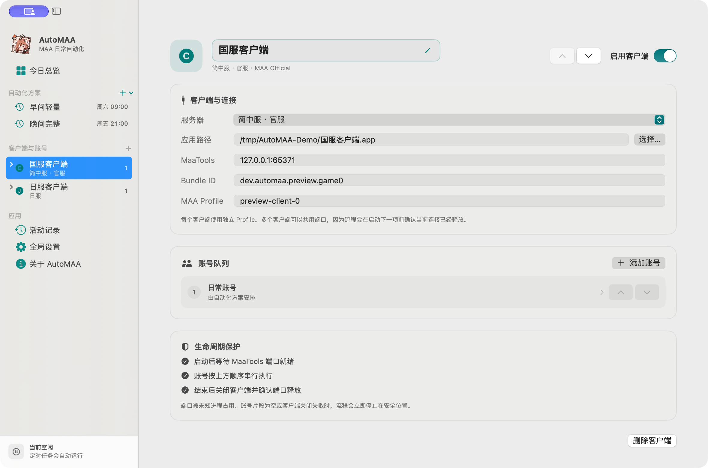
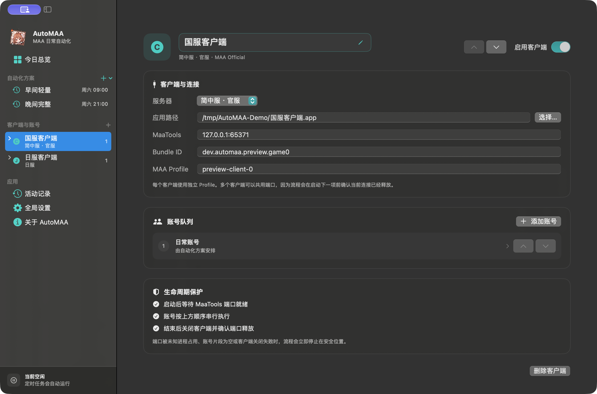
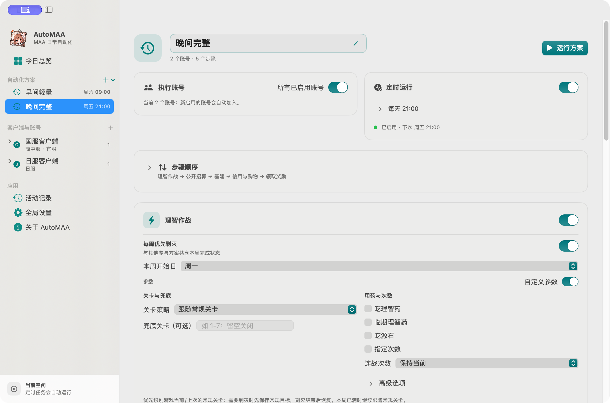
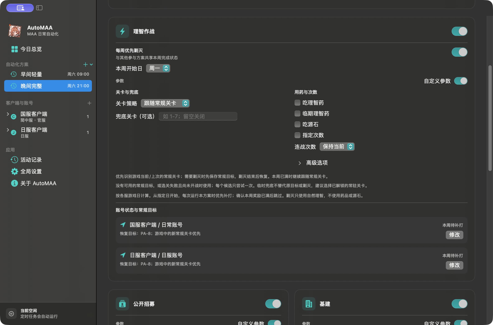

<figure class="slogan-artwork">
  
</figure>

<section class="product-showcase" aria-labelledby="product-tour-title">
  

    PRODUCT TOUR
    <h2 id="product-tour-title">一眼看清每套日常怎样执行</h2>
    
方案、目标账号、任务组合、定时时间和各自的运行检查状态集中呈现；确认后，再交给 AutoMAA 串行完成。

  

  <figure class="product-shot product-shot-wide">
    
    
    <figcaption><strong>今日总览</strong>先比较全部方案的状态摘要，再展开当前方案的路径与检查详情。</figcaption>
  </figure>

  

    <figure class="product-shot">
      
      
      <figcaption><strong>客户端与账号队列</strong>每个客户端独立配置，顺序、连接与关闭边界都清晰可见。</figcaption>
    </figure>
    <figure class="product-shot">
      
      
      <figcaption><strong>熟悉的 MAA 任务参数</strong>需要时精细配置，不需要时关闭开关使用 MAA 推荐值。</figcaption>
    </figure>
  

</section>

<section class="home-note">
  

    <h2>第一次打开被 macOS 拦截？</h2>
    
当前公开版本采用临时代码签名、尚未完成 Apple 公证。请先确认下载来源与校验值，再通过系统提供的“仍要打开”流程授权这一个 App。

    系统设置 → 隐私与安全性 → 仍要打开
  

  

    <h2>AutoMAA 与 MAA</h2>
    
AutoMAA 负责编排；<a href="https://github.com/MaaAssistantArknights/MaaAssistantArknights">MAA / MaaCore</a> 负责识别与操作。两者各司其职。

  

</section>
